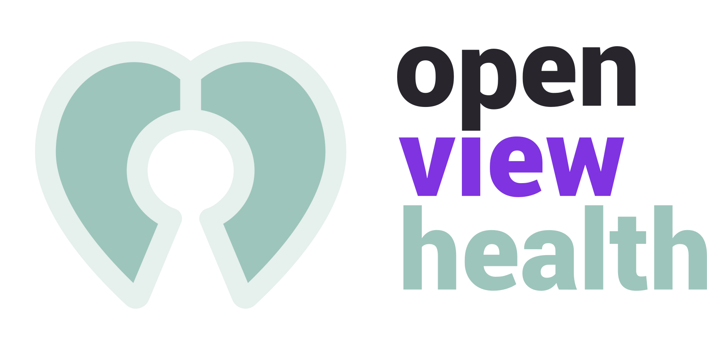

<a href="http://openview.health">
  
</a>

Open View Health is a free app anyone can use to visualize and
securely share their medical data. A modern DICOM visualizer powered
by Sethealth.

## Run locally

```bash
npm i
npm start
```

## How does it work?

### 🌐 Open source, open data

Open View Health is open source app licensed under the MIT license.
Medical data donated to the platform also becomes part of truly
public dataset, available to anyone interested.


### 🙈 Privacy-aware

All data remains offline without ever leaving your computer, we
never track users and data is fully anonymized before sharing.


### 🔒 End-to-end encrypted

If you decide to share, your data will be end-to-end encrypted with
AES256-GCM before it's uploaded. Since the encryption key is
generated on your device, nobody but you can access it, not even us.
[Learn more about our end-to-end encryption](#)


### 👤 HIPPA Compliant Anonymization

On top of the highest e2e encryption standard, your medical data is
always anonymized before being uploaded, so even if the data gets
compromised, it's impossible to trace it back to an specific person,
time or location.

Names, locations, dates, annotations, all metadata is removed
following the strictest guidelines of the
[HIPAA Privacy Rule's De-Identification Standard](https://www.hhs.gov/hipaa/for-professionals/privacy/special-topics/de-identification/index.html)


## Disclaimer

Open View Health is not intended to be used
as a medical device, and the site cannot and does not contain
medical/health advice. Any medical/health information is provided
for general informational and educational purposes only and is not a
substitute for professional advice.
